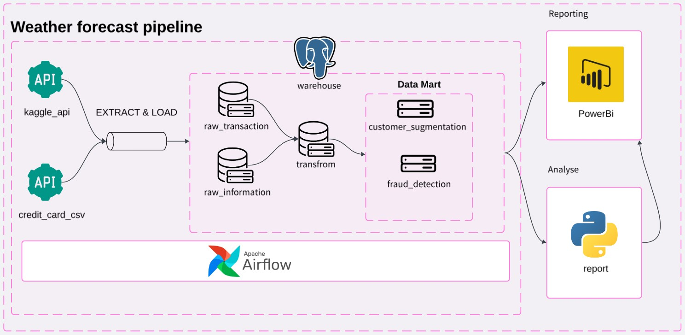
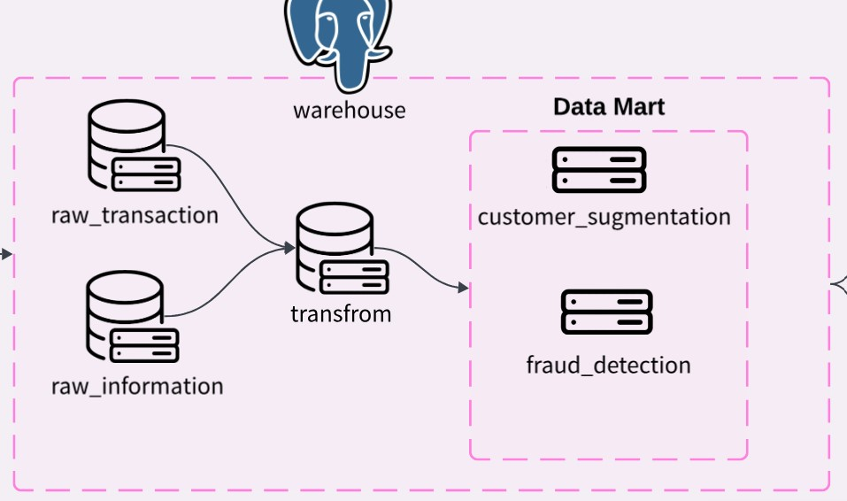

# Credit Card information pipeline

Simple pipeline that descard the credit card information from kaggle. The dataset been contain in the data warehouse will be used to analyze for report and prediction purposes

---

## Pipeline design 

Data infromation been extracted from public dataset(kaggle) using:
- Kaggle API
- Downloaded File

#### Data details

- [Credit card transaction dataset](https://www.kaggle.com/datasets/priyamchoksi/credit-card-transactions-dataset) (Data format: csv) been used from kaggle.
- Extracted data using kaggle API. Reference: [Dataset](https://www.kaggle.com/datasets/sakshigoyal7/credit-card-customers)

#### Data staging
Raw dataset from kaggle(csv) will be extract and load to data warehouse(PostgreSQL)

Based on the diagram, the data been stored can be categorized:

- Raw data
- Data mart

